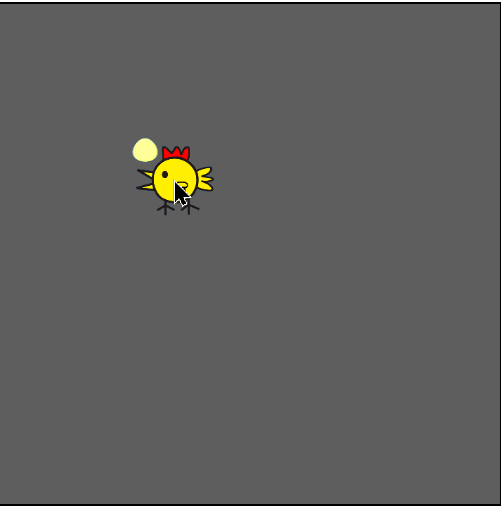

# Galinha feliz v0.0.1

Game criado com HTML5, CSS3 e JavaScript.
O objetivo é criar um game incrivel como jamais fora criado, e que esteja disponivel gratuitamente.

## Lógica
1. Importamos os objetos do game.
2. Criamos uma função para cada ação, andar e botar ovo.
4. Guardamos cada ovo colocado dentro de um array.
5. Criamos um timer.
6. No final do  timer contamos o array de ovos e mostramos em tela.

